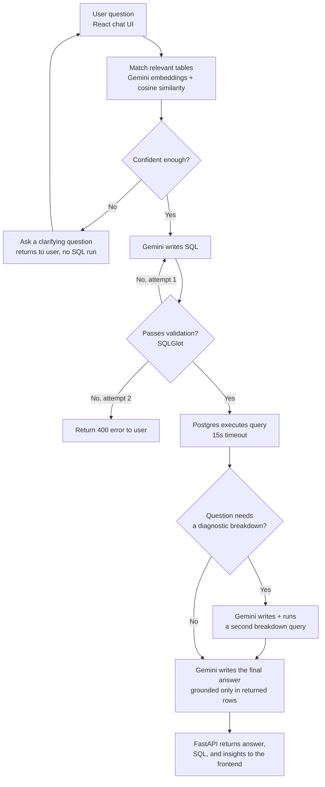

# DataPilot architecture

- **Table matching**: every table gets a one-time Gemini embedding, cached 5 minutes. The question gets embedded too, and cosine similarity picks the closest tables — no keyword lists.
- **Clarification**: triggered only when the best match's confidence is too low, or two tables score nearly the same. This is the one fixed threshold left in the pipeline.
- **SQL validation**: SQLGlot checks the query is read-only, references only real tables/columns, and is a single statement. A failed check feeds the real error back to Gemini for one retry before giving up.
- **Diagnostic breakdown**: Gemini itself decides, per question, whether a second segment-level query would help ("why did X drop" style questions) — no keyword detection.
- **Grounding**: the final answer prompt only ever sees the rows actually returned by Postgres (plus the breakdown rows, if any) — never invented numbers or causes.